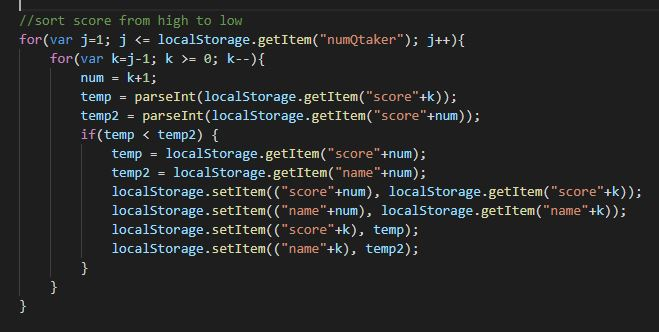

# Code Quiz

Code Quiz is a website to test user knowledge on Javascript by asking user 10 mulriplr choice questions and user needs to answer them within 60 seconds. When user pick a incorrect answer, time will deduct by 10 seconds. When time hit 0, quiz will force end and user needs to retake the quiz. Score is th e amount of time left after answering 10 questions. User needs to input name to save the score. Name and score are saved in local storage and when user click "score board", it will display score from high to low (code as shown on following picture).

The purpose of this project is to practice the use of local storage and Node.js. 

## Built With
* HTML
* CSS
* Javascript

## Website
https://maggie9685.github.io/code-quiz/

## Reference
Questions and answers used in this website are from https://codepen.io/boopalan002/pen/yKZVGa 

## License
Licensed under the MIT license.
